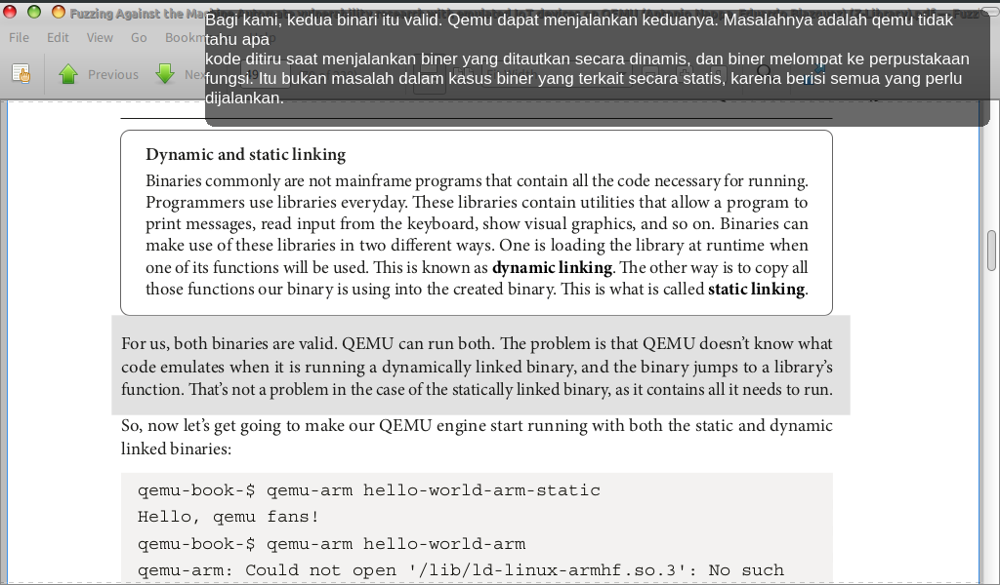

# install
```bash
sudo apt install tesseract-ocr
pip install pytesseract pillow pyqt5 pyperclip keyboard requests
```

# already environment
```bash
gunzip -c pyenv.tar.gz | tar -xzf -
source screen2clip/bin/activate
```
NOTE: change your path in screen2clip/pyvenv.cfg

# run
```bash
cd screen2translate
python3 myapp.py
```


